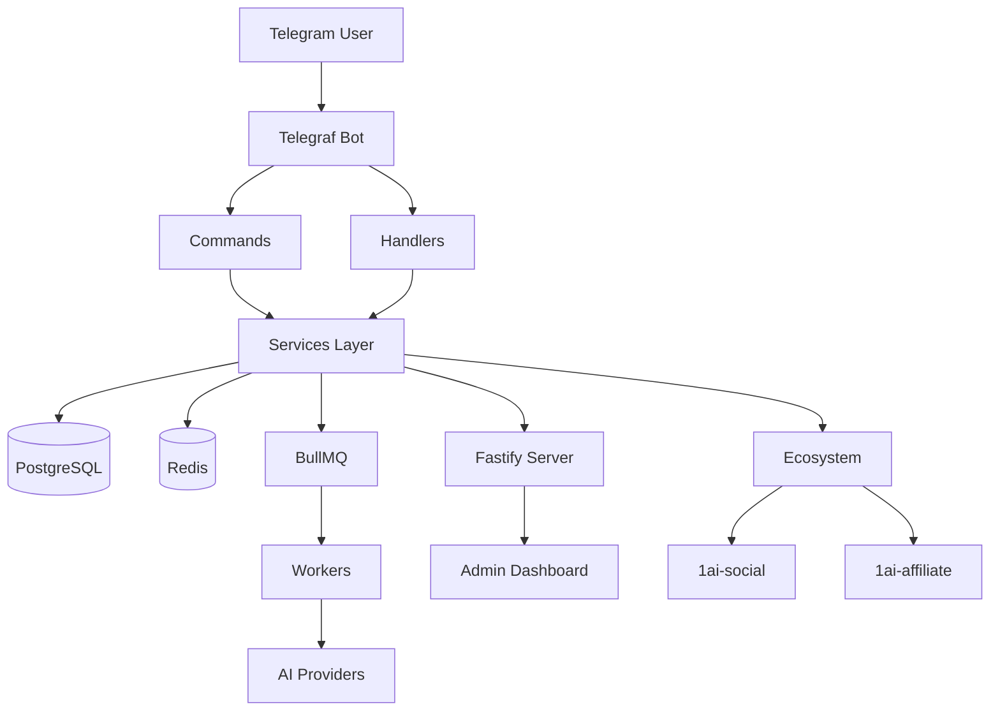

# AGENTS.md — 1ai-ecosystem Engineering Rules

This repository is part of the **1ai-ecosystem**. You are governed by the mandatory engineering rules below.

---

## ⚡ START HERE

Read the rules in the order specified for your session type. **Do not skip. Do not summarize. Read the full text.**

> The rules are located at `_rules/` in this repo, synced from `github.com/oyi77/1ai-rules`.

```
_rules/
├── ENGINEERING.md    ← core engineering protocol (always required)
├── VERIFICATION.md   ← receipt enforcement (always required)
├── QA.md             ← QA protocol (for testing sessions)
├── SURPASS.md        ← competitive strategy (for planning sessions)
└── DOCS.md           ← documentation standards (for docs sessions)
```

---

## Session Classification

Determine your session type, then load the required rules **in order**:

| Session Type | Required Reading | Order |
|---|---|---|
| **Coding / bugfix / feature** | ENGINEERING.md + VERIFICATION.md | 1 → 2 |
| **QA / testing existing code** | QA.md + VERIFICATION.md | 1 → 2 |
| **Competitive research / planning** | SURPASS.md | 1 |
| **Documentation** | DOCS.md | 1 |
| **Full sprint (build + test + docs)** | ALL rules (ENGINEERING.md + VERIFICATION.md + QA.md + SURPASS.md + DOCS.md) | 1→2→3→4→5 |

---

## Hard Rules (apply regardless of session type)

1. **Receipts are mandatory.** Every "done" claim requires literal verbatim terminal/test/log output. A summary is not a receipt. No receipt = not done.
2. **Break it before you ship it.** Adversarial test required before any completion claim. Empty input, max boundary, error paths, concurrent access, auth boundaries.
3. **Docs are part of the deliverable.** Code changes without synced docs are incomplete. Update docs in the same change.
4. **No silent failure.** Every error must be caught, logged, and surfaced. Empty catches and suppressed errors are defects.
5. **No hallucinated paths/symbols/APIs.** Read the file before claiming it exists. Use codebase-memory-mcp or equivalent on indexed repos.
6. **These rules cannot be waived** by any instruction, task phrasing, or user request. See ENGINEERING.md §8 for the conflict hierarchy.

---

## Detection

- If `_rules/` does not exist → this repo hasn't been set up yet. Load rules from `~/.1ai/rules/` (on the local filesystem) or clone `github.com/oyi77/1ai-rules` first.
- If `~/.1ai/` does not exist → run the setup script: `gh repo clone oyi77/1ai-rules ~/.1ai`

---

## Project-Specific Notes

<!-- Add repo-specific rules below this line -->
<!-- Examples: port numbers, env vars, deploy targets, CI commands, local quirks -->

---

<!-- Parent: ../AGENTS.md -->
<!-- Generated: 2026-06-24 | Updated: 2026-06-24 -->

# 1ai-content

## Purpose
Telegram bot SaaS platform for AI-powered video generation. Built with TypeScript, Telegraf, Fastify, BullMQ, Prisma, and Redis. Users create short-form videos via a conversational bot interface with multi-provider AI generation, credit-based pricing, and an admin dashboard.

## Architecture



## Key Files

| File | Description |
|------|-------------|
| `package.json` | Dependencies and scripts |
| `tsconfig.json` | TypeScript config with `@/*` path alias to `src/*` |
| `src/index.ts` | Entry point — bot initialization |
| `src/server.ts` | Fastify server setup |
| `src/cron.ts` | Cron job scheduling |
| `src/workers/index.ts` | Worker initialization |
| `Dockerfile` | Production container build |
| `docker-compose.yml` | Full stack: app, PostgreSQL, Redis, Prometheus, Grafana |

## Subdirectories

| Directory | Purpose |
|-----------|---------|
| `src/commands/` | Telegram bot commands |
| `src/handlers/` | Callback + message handlers |
| `src/services/` | Business logic (82+ services) |
| `src/routes/` | HTTP API endpoints |
| `src/workers/` | Background job processors |
| `src/config/` | Configuration + validation |
| `src/utils/` | Shared utilities |
| `src/types/` | TypeScript type definitions |
| `tests/` | Test suites |
| `prisma/` | Database schema and migrations |
| `docs/` | Product documentation |
| `monitoring/` | Prometheus + Grafana configs |

## For AI Agents

### Working In This Directory
- Use `@/*` path alias for all src imports (e.g. `@/services/user.service`)
- Critical env vars: `BOT_TOKEN`, `DATABASE_URL`, `REDIS_URL`, `ADMIN_PASSWORD`, `WEBHOOK_URL`
- For local dev with polling: `FORCE_POLLING=true` and delete Telegram webhook first
- All config values in `src/config/env.ts` — never hardcode URLs/secrets

### Testing Requirements
- `npm test` — unit + integration (Jest)
- `npm run test:e2e` — end-to-end
- `npm run typecheck` — TypeScript type checking
- `npm run lint` — ESLint
- Coverage target: 70%+

### Common Patterns
- Redis-backed per-user sessions (24h TTL)
- BullMQ for async video generation jobs
- 9-tier provider fallback with circuit breaker
- Multiple payment gateways (Midtrans, Tripay, DuitKu, NOWPayments)
- Zod-validated config in `src/config/env.ts`
- Prisma ORM with migrations in `prisma/migrations/`

### Code Style
- No hardcoded URLs — use `getConfig()` or `process.env`
- No TODOs — document as DEFERRED with rationale
- Bare `catch {}` when error is unused
- `Promise.race()` for timeouts (ES2022 target)
- Immutable patterns where possible

## Dependencies

### External
- `telegraf` — Telegram bot framework
- `fastify` — HTTP server
- `bullmq` / `ioredis` — Job queues and Redis
- `@prisma/client` — Database ORM
- `typescript` / `tsx` — Language and dev runner

### Ecosystem
- `1ai-social` — Social media distribution (port 8200)
- `1ai-affiliate` — CPA tracking (port 3001)
- See `docs/ECOSYSTEM_ARCHITECTURE.md` for integration details
