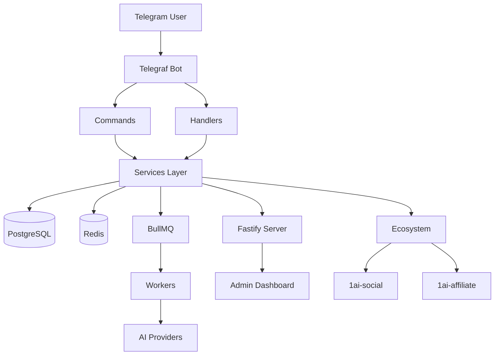

<!-- Parent: ../AGENTS.md -->
<!-- Generated: 2026-06-24 | Updated: 2026-06-24 -->

# 1ai-content

## Purpose
Telegram bot SaaS platform for AI-powered video generation. Built with TypeScript, Telegraf, Fastify, BullMQ, Prisma, and Redis. Users create short-form videos via a conversational bot interface with multi-provider AI generation, credit-based pricing, and an admin dashboard.

## Architecture

## Key Files

| File | Description |
|------|-------------|
| `package.json` | Dependencies and scripts |
| `tsconfig.json` | TypeScript config with `@/*` path alias to `src/*` |
| `src/index.ts` | Entry point — bot initialization |
| `src/server.ts` | Fastify server setup |
| `src/cron.ts` | Cron job scheduling |
| `src/workers/index.ts` | Worker initialization |
| `Dockerfile` | Production container build |
| `docker-compose.yml` | Full stack: app, PostgreSQL, Redis, Prometheus, Grafana |

## Subdirectories

| Directory | Purpose |
|-----------|---------|
| `src/commands/` | Telegram bot commands |
| `src/handlers/` | Callback + message handlers |
| `src/services/` | Business logic (82+ services) |
| `src/routes/` | HTTP API endpoints |
| `src/workers/` | Background job processors |
| `src/config/` | Configuration + validation |
| `src/utils/` | Shared utilities |
| `src/types/` | TypeScript type definitions |
| `tests/` | Test suites |
| `prisma/` | Database schema and migrations |
| `docs/` | Product documentation |
| `monitoring/` | Prometheus + Grafana configs |

## For AI Agents

### Working In This Directory
- Use `@/*` path alias for all src imports (e.g. `@/services/user.service`)
- Critical env vars: `BOT_TOKEN`, `DATABASE_URL`, `REDIS_URL`, `ADMIN_PASSWORD`, `WEBHOOK_URL`
- For local dev with polling: `FORCE_POLLING=true` and delete Telegram webhook first
- All config values in `src/config/env.ts` — never hardcode URLs/secrets

### Testing Requirements
- `npm test` — unit + integration (Jest)
- `npm run test:e2e` — end-to-end
- `npm run typecheck` — TypeScript type checking
- `npm run lint` — ESLint
- Coverage target: 70%+

### Common Patterns
- Redis-backed per-user sessions (24h TTL)
- BullMQ for async video generation jobs
- 9-tier provider fallback with circuit breaker
- Multiple payment gateways (Midtrans, Tripay, DuitKu, NOWPayments)
- Zod-validated config in `src/config/env.ts`
- Prisma ORM with migrations in `prisma/migrations/`

### Code Style
- No hardcoded URLs — use `getConfig()` or `process.env`
- No TODOs — document as DEFERRED with rationale
- Bare `catch {}` when error is unused
- `Promise.race()` for timeouts (ES2022 target)
- Immutable patterns where possible

## Dependencies

### External
- `telegraf` — Telegram bot framework
- `fastify` — HTTP server
- `bullmq` / `ioredis` — Job queues and Redis
- `@prisma/client` — Database ORM
- `typescript` / `tsx` — Language and dev runner

### Ecosystem
- `1ai-social` — Social media distribution (port 8200)
- `1ai-affiliate` — CPA tracking (port 3001)
- See `docs/ECOSYSTEM_ARCHITECTURE.md` for integration details
