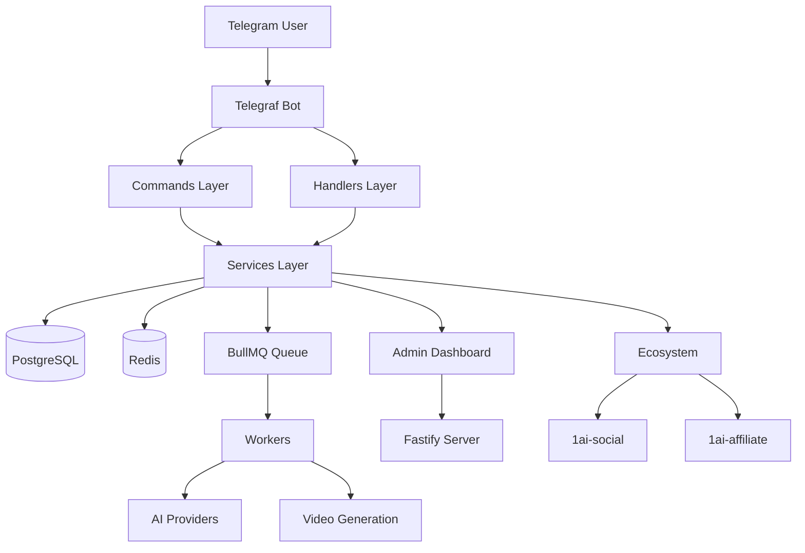
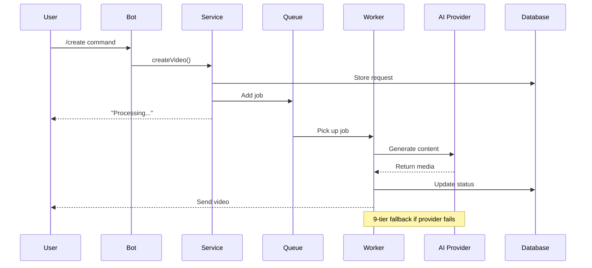
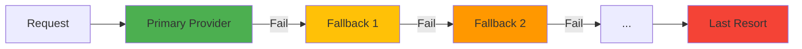

# 01 — Architecture

## System Architecture



## Data Flow: Video Generation



## Component Layers

### 1. Commands Layer (`src/commands/`)
- Entry points for Telegram commands
- Input validation and parsing
- Delegates to services

### 2. Handlers Layer (`src/handlers/`)
- Callback query handlers (inline buttons)
- Message handlers (state-based conversations)
- Error handling and retry logic

### 3. Services Layer (`src/services/`)
- Core business logic (82 service files)
- Database operations via Prisma
- External API integrations
- Circuit breaker pattern for resilience

### 4. Routes Layer (`src/routes/`)
- Fastify HTTP endpoints
- Admin dashboard routes
- Webhook handlers (payment gateways)
- Ecosystem integration endpoints

### 5. Workers Layer (`src/workers/`)
- BullMQ job processors
- Video generation pipeline
- Cleanup and maintenance jobs
- Daily/weekly report generation

## Provider Fallback Chain



9-tier fallback with circuit breaker:
1. Gemini (Google)
2. OpenAI
3. Grok (xAI)
4. OmniRoute
5. And 5 more providers...

## Database Schema

See [06-data-model.md](06-data-model.md) for full ER diagram.

Core entities:
- **User** — Telegram users with credits and tier
- **Video** — Generated video records
- **Transaction** — Payment transactions
- **Subscription** — User subscriptions
- **Commission** — Affiliate commissions

## Security Boundaries

| Layer | Auth | Validation |
|-------|------|------------|
| Bot | Telegram ID | Input sanitization |
| Admin | Password + JWT | Session management |
| Webhook | Signature verification | Payload validation |
| Ecosystem | HMAC-SHA256 | Timestamp + service key |

## Deployment

```
┌─────────────────────────────────────────┐
│           Cloudflare Tunnel             │
│         *.aitradepulse.com              │
└───────────────────┬─────────────────────┘
                    │
        ┌───────────┼───────────┐
        │           │           │
        ↓           ↓           ↓
   content:3000  social:8200  affiliate:3001
        │           │           │
        └───────────┼───────────┘
                    │
                    ↓
            ┌───────────────┐
            │  PostgreSQL   │
            │    Redis      │
            └───────────────┘
```
