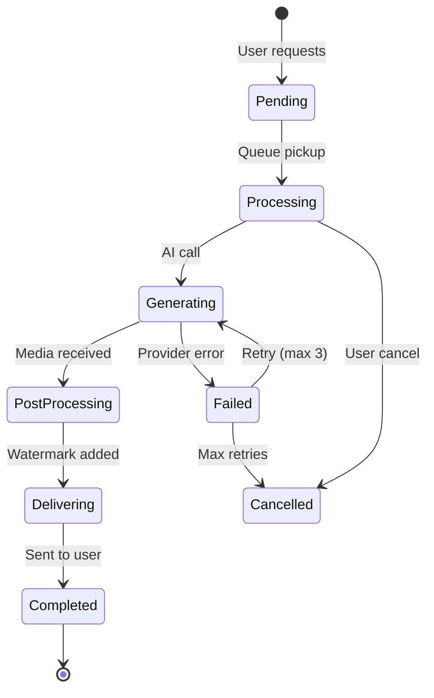
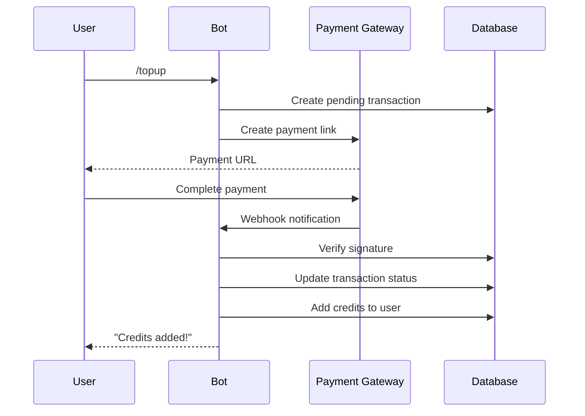

# 02 — Business Flows

## Domain Model

```mermaid
erDiagram
    User ||--o{ Video : creates
    User ||--o{ Transaction : pays
    User ||--o{ Subscription : has
    User ||--o{ Commission : earns
    
    Video ||--o{ VideoClip : contains
    Video }|--|| Platform : targets
    
    Transaction }|--|| PaymentGateway : uses
    Subscription }|--|| PricingConfig : follows
    
    User {
        bigint id PK
        bigint telegramId UK
        string tier
        decimal creditBalance
        string referralCode
    }
    
    Video {
        bigint id PK
        bigint userId FK
        string status
        string platform
        string mediaUrl
    }
    
    Transaction {
        bigint id PK
        bigint userId FK
        string orderId
        decimal amount
        string status
    }
}
```

## Core Business Rules

### 1. Credit System

```
User Tier → Credit Allocation
├── Free: 1 video (welcome bonus)
├── Starter: 20 credits
├── Growth: 100 credits
├── Business: 500 credits
└── Enterprise: Custom

1 video = 1 credit (30 sec)
2 credits = 1 credit (60 sec)
```

**Invariants:**
- Credit balance ≥ 0 (never negative)
- Credits expire after 30 days (subscription) or never (topup)
- Deduction happens BEFORE generation, refund on failure

### 2. Video Generation Pipeline



**Business Rules:**
- Max 3 retries per scene
- Provider fallback: 9-tier chain
- Timeout: 5 minutes per video
- Concurrent limit: 3 per user

### 3. Payment Flow



**Invariants:**
- Webhook signature MUST be verified
- Idempotent: duplicate webhooks don't double-credit
- Transaction status: pending → settlement/expired/failed

### 4. Affiliate Commission

```
User A refers User B
User B purchases credits
→ User A gets 10% commission (credits)
→ User B gets 5% bonus credits
```

**Rules:**
- Commission calculated on net amount (after discount)
- Commission credited after payment settlement
- Max 3 referral tiers (A→B→C→D)

## State Machines

### Video Status
- `pending` → `processing` → `generating` → `post_processing` → `delivering` → `completed`
- Any state → `failed` (with retry)
- `failed` → `cancelled` (after max retries)

### Transaction Status
- `pending` → `settlement` / `expired` / `denied` / `failed`
- Only `settlement` triggers credit addition

### User Tier
- `free` → `starter` / `growth` / `business` / `enterprise`
- Tier determines credit allocation and pricing

## Edge Cases

| Scenario | Handling |
|----------|----------|
| Payment webhook duplicate | Idempotent check on orderId |
| Credit deduction race condition | Atomic DB transaction |
| Provider timeout | Circuit breaker + fallback |
| User cancels mid-generation | Graceful cancellation |
| Concurrent generation limit | Queue with user-specific concurrency |
