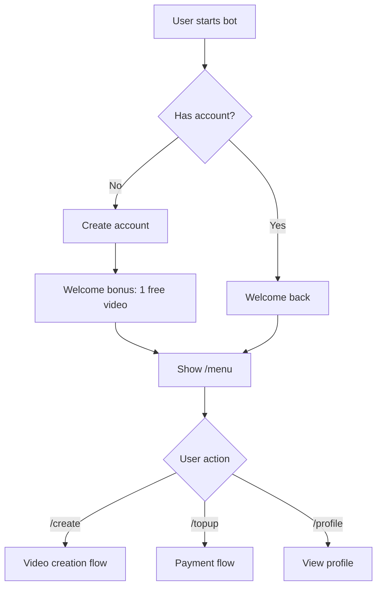
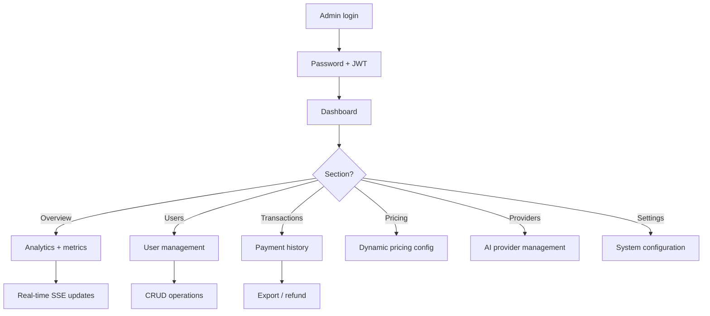

# 03 — User Flows

## Primary User Journeys

### 1. New User Onboarding



### 2. Video Creation Flow

```mermaid
graph TD
    A[/create command] --> B[Select platform]
    B --> C[TikTok / Instagram / YouTube / Square]
    C --> D[Select mode]
    D --> E{Mode?}
    
    E -->|Basic| F[Upload photo]
    E -->|Smart| G[Select preset + upload]
    E -->|Pro| H[Full control + upload]
    
    F --> I[Enter niche]
    G --> I
    H --> I
    
    I --> J[AI generates script]
    J --> K[User approves / edits]
    K --> L[Queue video generation]
    L --> M[Processing...]
    M --> N[Video delivered]
```

**User states during flow:**
1. Idle → Waiting for platform selection
2. Waiting for photo upload
3. Waiting for niche input
4. Waiting for script approval
5. Waiting for video generation

### 3. Payment Flow

```mermaid
graph TD
    A[/topup command] --> B[Select package]
    B --> C{Package?}
    
    C -->|Starter| D[20 credits - Rp 49K]
    C -->|Growth| E[100 credits - Rp 149K]
    C -->|Business| F[500 credits - Rp 499K]
    
    D --> G[Select payment method]
    E --> G
    F --> G
    
    G --> H{Method?}
    H -->|Bank Transfer| I[Midtrans/Tripay]
    H -->|E-Wallet| J[GoPay/OVO/DANA]
    H -->|Crypto| K[NOWPayments]
    
    I --> L[Payment link]
    J --> L
    K --> L
    
    L --> M[User pays]
    M --> N[Webhook received]
    N --> O[Credits added]
    O --> P[Confirmation sent]
```

### 4. Admin Dashboard Flow



## Role-Based Differences

| Feature | Free User | Paid User | Admin |
|---------|-----------|-----------|-------|
| Video creation | 1 free | Unlimited (credits) | Unlimited |
| Platforms | TikTok only | All | All |
| Modes | Basic only | Basic/Smart/Pro | All |
| HD download | ❌ | ✅ | ✅ |
| Analytics | ❌ | Basic | Full |
| Admin dashboard | ❌ | ❌ | ✅ |

## Error Recovery Flows

### Video Generation Failed
```
1. User notified: "Generation failed, retrying..."
2. Automatic retry (up to 3 times)
3. If all retries fail:
   - User notified: "Generation failed"
   - Credits refunded automatically
   - Error logged for admin review
```

### Payment Failed
```
1. Webhook received with failure status
2. Transaction marked as failed
3. User notified: "Payment failed"
4. No credits added
5. User can retry with /topup
```

### Provider Timeout
```
1. Primary provider times out (30s)
2. Circuit breaker opens
3. Fallback to next provider
4. User sees: "Processing..." (no error)
5. Circuit breaker resets after 5 minutes
```

## Navigation Map

```
/start → Welcome
/menu → Main menu
├── /create → Video creation
├── /topup → Payment
├── /profile → User info
├── /credits → Credit balance
├── /help → Help text
└── /settings → User settings

/admin → Admin dashboard
├── /admin/dashboard → Overview
├── /admin/users → User management
├── /admin/pricing → Pricing config
├── /admin/providers → Provider management
└── /admin/settings → System settings
```
