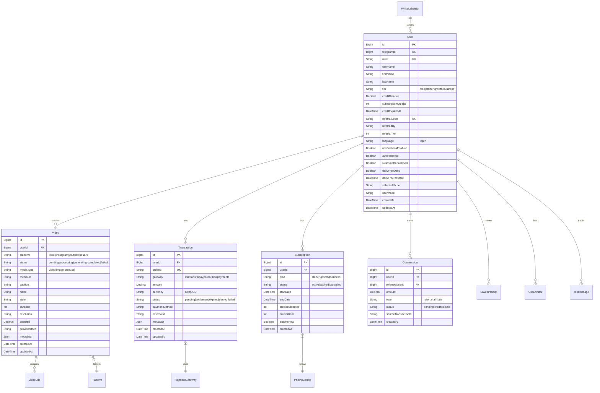

# 06 — Data Model

## ER Diagram



## Core Tables

### Users
Primary user table. Each Telegram user gets one record.

**Key indexes:**
- `telegramId` — unique, used for bot lookups
- `referralCode` — unique, used for referral tracking
- `tier` — used for pricing queries

### Videos
Records of all generated content.

**Key indexes:**
- `userId` — user's videos
- `status` — active generations
- `createdAt` — time-based queries

**Status transitions:**
```
pending → processing → generating → post_processing → delivering → completed
                ↓           ↓              ↓
              failed      failed        failed
                ↓
            (retry up to 3x)
                ↓
            cancelled
```

### Transactions
Payment records from all gateways.

**Key indexes:**
- `orderId` — unique, used for webhook matching
- `userId` + `status` — user payment history
- `gateway` + `externalId` — gateway-specific lookups

### Subscriptions
Active user subscriptions.

**Key indexes:**
- `userId` — user's subscription
- `status` — active subscriptions
- `endDate` — expiration queries

## Prisma Schema Location

```
prisma/
├── schema.prisma           → Main schema
├── migrations/             → Migration history
└── seed.ts                 → Seed data
```

## Common Queries

### Get user with balance
```typescript
const user = await prisma.user.findUnique({
  where: { telegramId: BigInt(telegramId) },
  select: { id: true, creditBalance: true, tier: true }
});
```

### Create transaction
```typescript
const transaction = await prisma.transaction.create({
  data: {
    userId: user.id,
    orderId: generateOrderId(),
    amount: 49000,
    currency: 'IDR',
    gateway: 'midtrans',
    status: 'pending'
  }
});
```

### Get active videos
```typescript
const videos = await prisma.video.findMany({
  where: {
    userId: user.id,
    status: { in: ['pending', 'processing', 'generating'] }
  },
  orderBy: { createdAt: 'desc' }
});
```

## Data Integrity Rules

1. **Credit balance** — must be ≥ 0, enforced at DB level
2. **Transaction orderId** — unique constraint prevents duplicates
3. **User telegramId** — unique constraint ensures one account per Telegram user
4. **Video status** — must follow valid state machine transitions
5. **Cascade deletes** — deleting user cascades to videos, transactions, subscriptions
